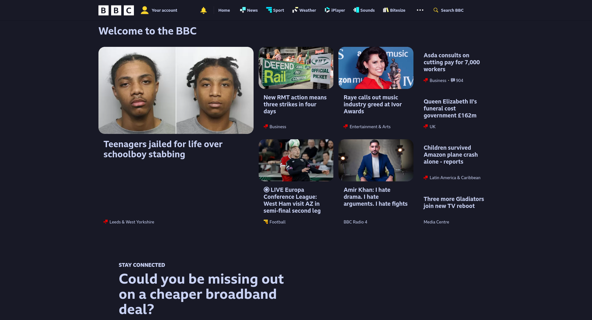
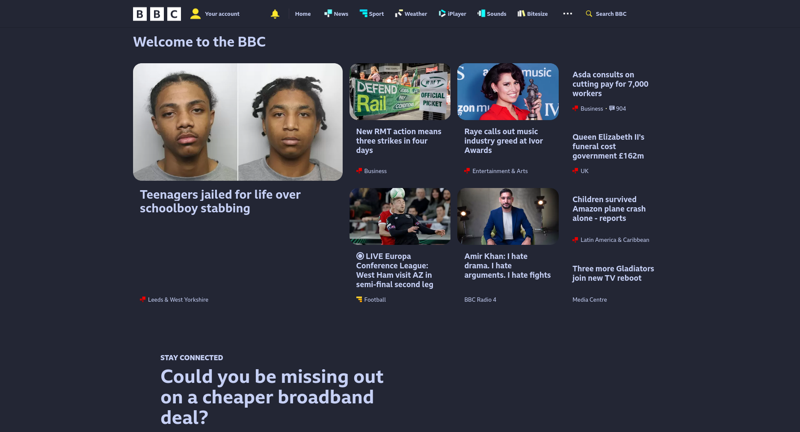
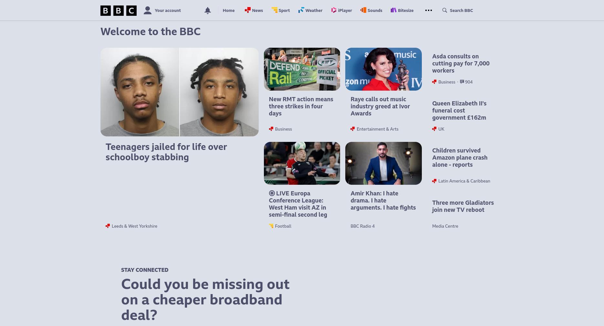

## Userstyles for `bbc.co.uk`

They are really basic css styles, because the BBC site is simply too large for me to style each of the elements manually. It would just be nicer to keep everything simple and consistent.

> Styles also applies to any BBC sites, such as [BBC Bitesize](https://www.bbc.co.uk/bitesize)

### Edits

#### All

These are the edits in all styles within this subdirectory.

- Rounded corners of input boxes, buttons and images.
- Applied theme colours palettes.

#### Darker themes

These are the edits appilied to darker themes (mocha, frappe, macchiato) within this subdirectory.

- Inverted colours of images in darker themes for them to stay visible.

### Themes

#### Catppuccin Macchiato

#### Catppuccin Mocha

#### Catppuccin Frappe

#### Catppuccin Latte

