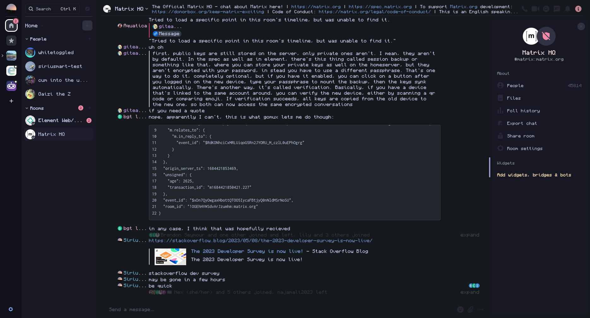

## Userstyles for `element.io`

The first big CSS project I've ever worked on, the goal is the completely theme Element to a custom Catppuccin theme.

Only colours are changed as I wanted to use the colour theme to be a base for other layout css styles.

Might try to conditionally enable styles depending on theme (light/dark) selected within Element settings, please open a pull request if you know how to do that.

### Themes

#### Catppuccin Mocha (WIP)

- [ ] Search and left panel buttons are unstyled.
- [ ] Button hovers are unstyled.
- [ ] Space select outline is unstyled.
- [ ] Need to hunt down the remains of Element green.

