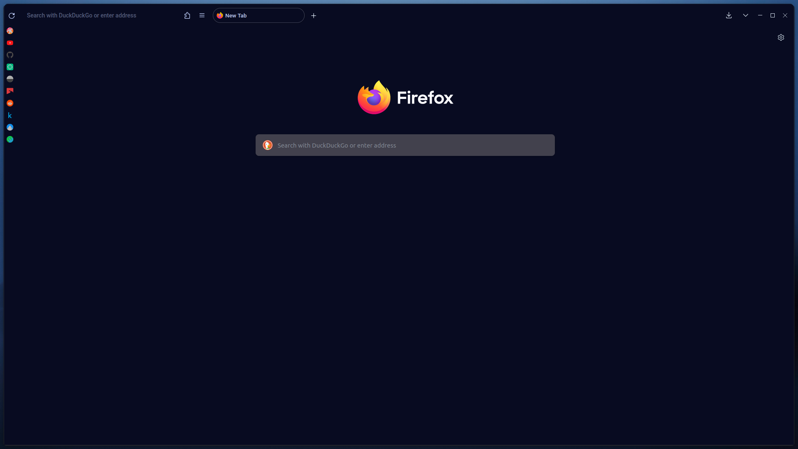

## userChrome for Firefox

A way to style Firefox using just CSS, There is currently only one theme, but I am still using this folder structure just in case.

> Anyone know where's the docs for userChrome.css? It has been a real pain in my rear end styling it.

### Applying the themes

1. Go to [about:config](about:config) on Firefox, accept risk and continue.
2. Enabled `toolkit.legacyUserProfileCustomizations.stylesheets` - set its value to `true` by double clicking on the `false` value.
3. Go to [about:profiles](about:profiles) and click *Open Directory* for the profile you want to apply the css to.
4. Create a directory within the Firefox profile root called `chrome`.
5. In the directory, drag all the relevant content from this repo, into the folder.

Your directory should look something like:

```
├── firefox-csshacks
│   ├── chrome
│   │   ├── auto_devtools_theme_for_rdm.css
│   │   ├── autohide_bookmarks_and_main_toolbars.css
│   │   ├── autohide_bookmarks_toolbar.css
│   │   ├── autohide_main_toolbar.css
│   │   ├── autohide_menubar.css
│   │   ├── autohide_navigation_button.css
│   │   ├── autohide_sidebar.css
│   │   ├── autohide_tabstoolbar.css
│   │   ├── autohide_toolbox.css
│   │   ├── ...
│   │   ├── vertical_urlbar_one-off_items.css
│   │   ├── window_control_fallback_for_custom_windows_theme.css
│   │   ├── window_control_force_linux_system_style.css
│   │   └── window_control_placeholder_support.css
├── OnelineProton
│   └── userChrome.css
└── userChrome.css
```

6. Go back go [about:profiles](about:profiles) and click *Restart Normally*.

> If for some reasons it doesn't work, ~~please seem mental guidance~~ read some other tutorials online.

### Themes

#### Rounded GX (WIP)

I don't know what to name this, but it looks a bit like Opera GX from the vertical bookmarks bar with rounded buttons. So I'm calling it rounded GX.

This userChrome css looks the best with:

- My [monotone dark](https://github.com/newmanls/OnelineProton) Firefox theme - it removes boundaries between different panels, especially significant with the new layout.
- Linux systems where Firefox uses native GTK instead of the ugly Windows version - it makes various buttons to blend it more. Ditch the bloatware from Mircrosoft and [switch to Linux!](https://endeavouros.com/download/)

> Credits to MrOtherGuy for his [firefox-csshacks](https://github.com/MrOtherGuy/firefox-csshacks) and newmanls for his [OnelineProton](https://github.com/newmanls/OnelineProton).

- [x] Vertical bookmarks bar.
- [x] Oneline Proton.
- [x] Better Proton right click menu.
- [x] Colour corrected bookmarks/tab icons.
- [x] Rounded items.
- [ ] Some buttons are not round on hover - download, tablist, and close tab are all Proton square.

And also various tweaks as listed below:

- Moved close tab button to favicon.
- Status panel is now centred (you will notice once you start using it).
- Compact extensions.
- Iconised main menu.
- Tab tooltips (for long tab titles).
- Removed tabs scroll button.

There are two lines commented out in the root `userChrome.css`, feel free to uncomment them back in, or add your own css to the file.

> Opening a pull request and contributing back into this repo will be more than welcome.


